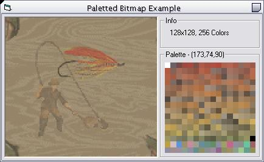



## Loading a paletted bitmap

### Description

Demonstrates reading a bitmap's header in binary to determine the bit depth (amount of colors) and the palette information. Useful for beginners who want to work with paletted bitmaps, or anyone interested in binary files.
 
### More Info
 
A 16 or 256 color bitmap.

How to type ;)

The size, bit depth, and palette information of the inputted bitmap.

Palette window only redraws on mouseover.

             |
---                |---
**Submitted On**   |2002-12-03 23:37:28
**By**             |[Jeffrey Katz](https://github.com/Planet-Source-Code/PSCIndex/blob/master/ByAuthor/jeffrey-katz.md)
**Level**          |Beginner
**User Rating**    |5.0 (10 globes from 2 users)
**Compatibility**  |VB 4\.0 \(32\-bit\), VB 5\.0, VB 6\.0
**Category**       |[Graphics](https://github.com/Planet-Source-Code/PSCIndex/blob/master/ByCategory/graphics__1-46.md)
**World**          |[Visual Basic](https://github.com/Planet-Source-Code/PSCIndex/blob/master/ByWorld/visual-basic.md)
**Archive File**   |[Loading\_a\_1507471232002\.zip](https://github.com/Planet-Source-Code/jeffrey-katz-loading-a-paletted-bitmap__1-41282/archive/master.zip)

